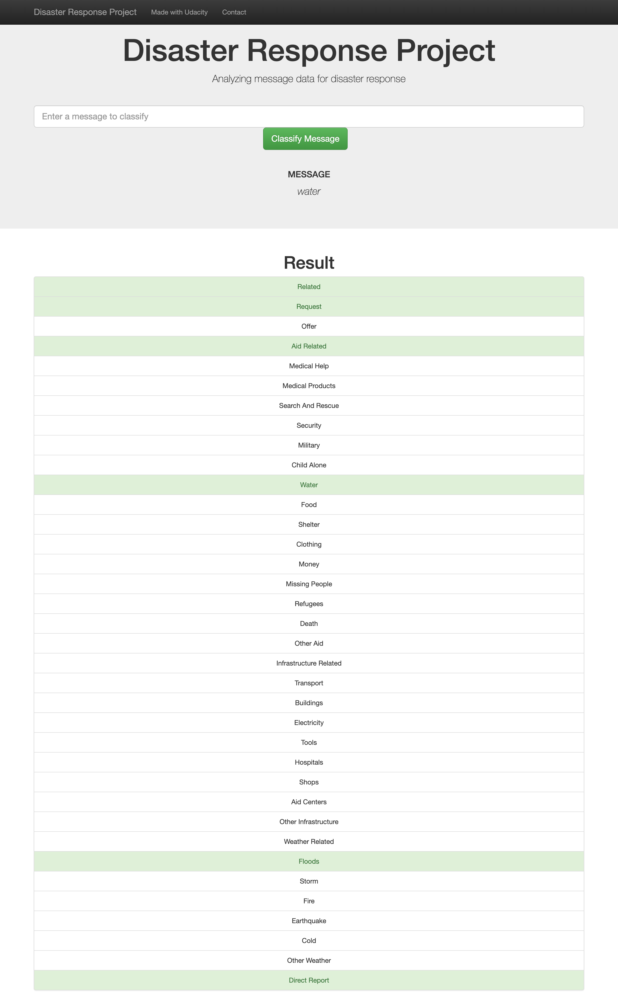
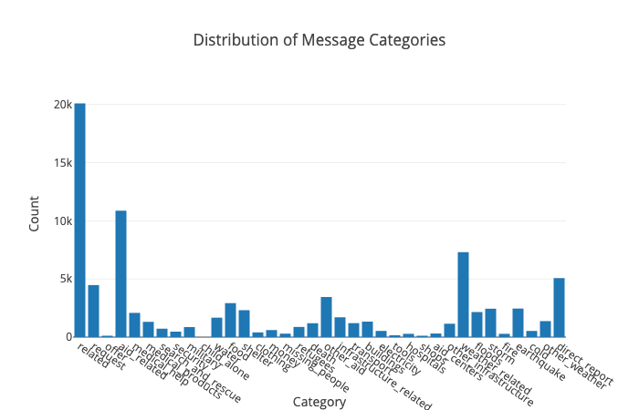

# DSND-Disaster-Response-Pipeline-Project
 
## Contents:

1. [Description](#description)
2. [Packages and Dependency](#Packages) 
3. [Authors](#authors) 
4. [Acknowledgement](#acknowledgements)
5. [how it is work ](#how) 

## Description 
This Project is one of Udacity Requirements to complete Data science Nano Degree 

In this project, We will try to build a small system to categories the messages that come for disaster center from tweets on twitter platform to make the work easy by converting the messages to the desired department we will see   how to build ETL Pipeline and NLP pipeline, plus build our model using ML pipeline 

In this project we use data engineering to analyze and clean data and then apply machine learning model by using the data provided by Figure Eight and the apply data engineering on this data and then apply the machine learning model where we receive messages to the disaster center by users and try to know Categorize of this message based on cleaning data.
below we will see the most important file and function in this project.
1- process_data.py in this file we build ETL Pipeline contains merge data together and remove outliers and duplicate records cleaning and preparing the data.
2- rain_classifier.py in this file we work on NLP pipeline we fetch the clean data and do tokenize and lemmatize on data record then build Machine learning model and finally we save the model to apply it on our web page.

Installing
Clone this GIT repository:
git clone 
(https://github.com/faizzal/DSND-Disaster-Response-Pipeline-Project.git)

 
## Packages and Dependency 
•	Python 3 
•	Machine Learning Libraries: NumPy, Pandas , Sciki-Learn
•	Natural Language Process Libraries: NLTK
•	Database : SQLalchemy
•	Web App and Data Visualization: Flask, Plotly
Execution:
1.	Run the following commands in the project's root directory to set up your database and model.
o	To run ETL pipeline that cleans data and stores in database python data/process_data.py data/disaster_messages.csv data/disaster_categories.csv data/DisasterResponse.db
o	To run ML pipeline that trains classifier and saves python models/train_classifier.py data/DisasterResponse.db models/classifier.pkl
2.	Run the following command in the app's directory to run your web app. python run.py
3.	Go to http://0.0.0.0:3001/
Additional Material
In the data and models folder you can find two jupyter notebook that will help you understand how the model works step by step:
1.	ETL Preparation Notebook: learn everything about the implemented ETL pipeline
2.	ML Pipeline Preparation Notebook: look at the Machine Learning Pipeline developed with NLTK and Scikit-Learn
You can use ML Pipeline Preparation Notebook to re-train the model or tune it through a dedicated Grid Search section. In this case, it is warmly recommended to use a Linux machine to run Grid Search, especially if you are going to try a large combination of parameters. Using a standard desktop/laptop (4 CPUs, RAM 8Gb or above) it may take several hours to complete.

 
## Authors 
(https://github.com/faizzal)
 
 
## Acknowledgements

•	Udacity for help me to pass this project and provide me all material that I need it 
•	Figure Eight for providing dataset that helps to work on model and cleaning data

 
## How to Use It 
1.	Go to http://0.0.0.0:3001/ and type the message in text box
2.	Then click classify
 
2.a. you can see the analyzing of categories in home page
  
2.	After click classify you will get all categories that message belong to.
 

